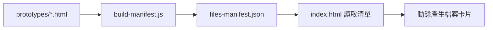

# 📋 Files Manifest 自動化系統教學指南

## 🔍 問題背景：為什麼需要 Files Manifest？

### 瀏覽器安全限制

在網頁環境中，由於**同源政策（Same-Origin Policy）**的安全限制，JavaScript 無法：
- 列舉目錄內容：`fetch('./prototypes/')` 無法獲得資料夾內的檔案清單
- 探測檔案存在性：無法程式化判斷某個檔案是否存在
- 任意存取檔案系統：只能存取明確指定路徑的檔案

```javascript
// ❌ 這些操作在網頁中是不可能的
const files = await fetch('./prototypes/').then(r => r.json()); // 會失敗
const exists = await checkFileExists('./unknown_file.html');    // 不可能實現
```

### 靜態網站的挑戰

**靜態檔案伺服器（如 GitHub Pages）特性：**
- 只能回應明確的檔案請求
- 不提供目錄瀏覽 API
- 無法動態生成檔案清單

**動態伺服器（如 Express）的優勢：**
- 可以實作 `/api/files` endpoint
- 主動掃描檔案系統並回傳清單
- 完全控制要暴露哪些資訊

## 💡 解決方案：Files Manifest 系統

### 核心概念

`files-manifest.json` 是一個**預生成的檔案清單**，包含：
- 所有 HTML 檔案的名稱、標題、描述
- 檔案修改時間和大小
- 統計資訊和元數據

```json
{
  "metadata": {
    "version": "1.0.0",
    "generated": "2025-09-27T16:07:42.764Z",
    "totalFiles": 55
  },
  "files": [
    {
      "name": "modern_architecture_firm.html",
      "title": "Modern Architecture Firm",
      "description": "專業極簡美學，動態建築線條與藍圖網格",
      "lastModified": "2025-09-25T17:56:18.933Z",
      "size": 26
    }
  ]
}
```

### 運作機制



## ⚠️ 違反 OCP 的問題

### 開放封閉原則（Open-Closed Principle）

> 軟體實體應該對擴展開放，對修改封閉

**原有的問題：**
1. 每次新增 `.html` 檔案，都要手動執行 `npm run build`
2. 如果忘記這個步驟，新檔案不會出現在網頁界面
3. `files-manifest.json` 在每次有新內容時都要被修改
4. 容易出錯且增加維護負擔

```bash
# 舊的工作流程（容易出錯）
echo "新增檔案..." > prototypes/new_style.html
# 😱 忘記執行下面這行，新檔案就不會顯示
npm run build
```

## 🚀 自動化解決方案

### 1. 改進 Scripts 配置

```json
{
  "scripts": {
    "start": "node server.js",                    // 純伺服器模式
    "dev": "npm run build && node server.js",    // 自動 build + 啟動
    "dev:watch": "concurrently \"chokidar 'prototypes/*.html' -c 'npm run build'\" \"nodemon server.js\"",
    "build": "node build-manifest.js"             // 建構 manifest
  }
}
```

### 2. 智慧檢測機制

在 `server.js` 中加入檔案新鮮度檢查：

```javascript
async function checkManifestFreshness() {
    const manifestPath = path.join(__dirname, 'files-manifest.json');

    try {
        // 1. 獲取 manifest 的修改時間
        const manifestStat = await fs.stat(manifestPath);
        const manifestTime = manifestStat.mtime;

        // 2. 掃描所有 HTML 檔案
        const files = await fs.readdir('./prototypes');
        const htmlFiles = files.filter(f => f.endsWith('.html'));

        // 3. 檢查是否有檔案比 manifest 更新
        for (const file of htmlFiles) {
            const fileStat = await fs.stat(path.join('./prototypes', file));
            if (fileStat.mtime > manifestTime) {
                return true; // 需要更新
            }
        }

        // 4. 檢查檔案數量是否一致
        const manifest = JSON.parse(await fs.readFile(manifestPath, 'utf-8'));
        if (manifest.files.length !== htmlFiles.length) {
            return true; // 檔案數量不同，需要更新
        }

        return false; // 不需要更新
    } catch (error) {
        return true; // manifest 不存在或損壞，需要重建
    }
}
```

### 3. 自動重建邏輯

```javascript
async function ensureManifestUpToDate() {
    console.log('🔍 檢查 manifest 狀態...');

    const needsUpdate = await checkManifestFreshness();

    if (needsUpdate) {
        console.log('🔄 偵測到檔案變更，重建 manifest...');
        try {
            execSync('node build-manifest.js', {
                stdio: 'inherit',
                cwd: __dirname
            });
            console.log('✅ Manifest 更新完成');
        } catch (error) {
            console.error('❌ Manifest 更新失敗:', error.message);
        }
    } else {
        console.log('✅ Manifest 已是最新版本');
    }
}

// 在伺服器啟動時執行（僅開發模式）
async function start() {
    if (process.env.NODE_ENV !== 'production') {
        await ensureManifestUpToDate();
    }
    // ... 啟動伺服器
}
```

## 🔧 檢測策略比較

### 方法一：檔案時間戳比較（推薦）

**優點：**
- 效能好：只需讀取檔案 stat，不用開啟內容
- 準確性高：直接反映檔案修改時間
- 實作簡單：Node.js 內建支援

**注意事項：**
- Git clone 後時間戳可能不準確
- 某些部署環境可能會改變檔案時間

### 方法二：檔案數量比較

**優點：**
- 快速檢查：只需比較數字
- 可靠性高：不受時間戳影響

**限制：**
- 無法偵測檔案內容變更
- 只適合檢測新增/刪除檔案

### 方法三：內容雜湊比較

**優點：**
- 最準確：能偵測任何內容變更
- 完整性保證：確保檔案完全一致

**缺點：**
- 效能較差：需要讀取所有檔案內容
- 複雜度高：需要計算和儲存雜湊值

## 📊 最佳實務建議

### 混合檢測策略

```javascript
async function comprehensiveCheck() {
    // 1. 快速數量檢查
    const countChanged = await checkFileCount();
    if (countChanged) return true;

    // 2. 時間戳檢查
    const timeChanged = await checkModificationTime();
    if (timeChanged) return true;

    // 3. 如果需要，進行深度內容檢查
    // const contentChanged = await checkContentHash();

    return false;
}
```

### 開發工作流程

```bash
# 🎯 推薦：日常開發
npm run dev        # 自動 build + 啟動，一個指令搞定

# 🔄 監控模式：頻繁修改檔案時
npm run dev:watch  # 檔案變更時自動重建

# ⚡ 純測試：不想重建時
npm start          # 只啟動伺服器，不執行 build

# 🔨 手動建構：需要時
npm run build      # 手動重建 manifest
```

## 💭 架構思考

### 為什麼這樣設計？

1. **分離關注點**：建構邏輯（build）與運行邏輯（start）分開
2. **向後相容**：保留原有的手動模式
3. **環境感知**：生產環境不執行自動檢查
4. **錯誤處理**：build 失敗時仍可啟動伺服器

### 業界標準比較

**現代前端工具的常見模式：**
- Vite：`vite dev`（自動編譯 + 熱重載）
- Next.js：`next dev`（自動編譯 + 熱重載）
- Create React App：`react-scripts start`（自動編譯）

**我們的設計優點：**
- 符合業界慣例
- 保持專案輕量化
- 不依賴複雜的構建工具

## 🎯 效果驗證

### 成功指標

1. **OCP 合規**：新增檔案不需修改現有代碼 ✅
2. **開發效率**：一個指令啟動完整環境 ✅
3. **錯誤預防**：避免忘記更新 manifest ✅
4. **向後相容**：保留所有原有功能 ✅

### 測試案例

```bash
# 測試 1：新增檔案自動檢測
echo "新檔案" > prototypes/test.html
npm run dev  # 應該自動檢測並重建

# 測試 2：智慧檢測
echo "另一個檔案" > prototypes/test2.html
node server.js  # 伺服器啟動時應自動檢測

# 測試 3：無變更時不重建
npm run dev  # 第二次執行應顯示「已是最新版本」
```

## 🔮 未來擴展可能

### 進階功能

1. **檔案監控模式**：使用 `chokidar` 監控檔案變化
2. **增量更新**：只更新變更的檔案資訊
3. **快取機制**：避免重複掃描未變更的檔案
4. **Git 整合**：基於 Git 狀態判斷檔案變更

### Hook 整合

```bash
# Git pre-commit hook
#!/bin/sh
npm run build
git add files-manifest.json
```

## 📝 總結

這個自動化系統成功解決了：
- **技術問題**：瀏覽器安全限制導致的檔案列舉困難
- **流程問題**：手動維護 manifest 容易出錯
- **架構問題**：違反 OCP 原則的設計缺陷

透過智慧檢測和自動化重建，我們實現了：
- 零維護成本的檔案管理
- 符合現代開發慣例的工作流程
- 保持專案簡潔性的技術方案

這是一個很好的例子，展示了如何在技術限制和開發效率之間找到平衡點！